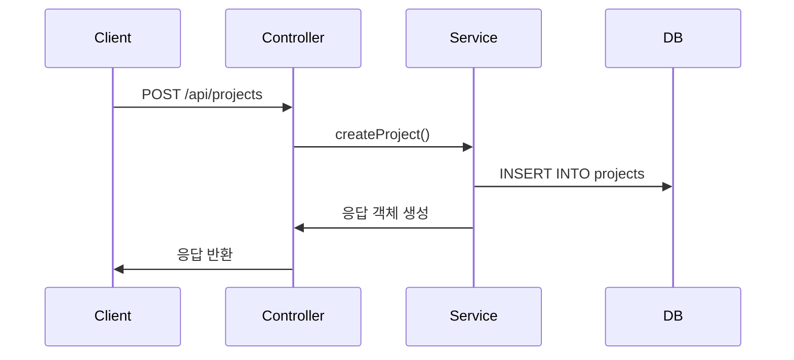

# 🧱 아키텍처 문서

## 시스템 구성도

---

## 구성 요소

### Controller

- 클라이언트 요청 처리
- 경로: `src/controllers/`

### Service

- 비즈니스 로직 처리
- 경로: `src/services/`

### Model

- DB ORM 모델 정의
- 경로: `src/models/`

---

## 데이터 흐름

---

## 설계 기준

- RESTful 설계 원칙
- 계층별 책임 분리 (Controller, Service, Model)
- 테스트 및 확장 고려

---

## 향후 개선 방향

- 로깅/모니터링 도입
- 서비스 레이어 세분화
- CQRS 또는 Hexagonal 구조 검토